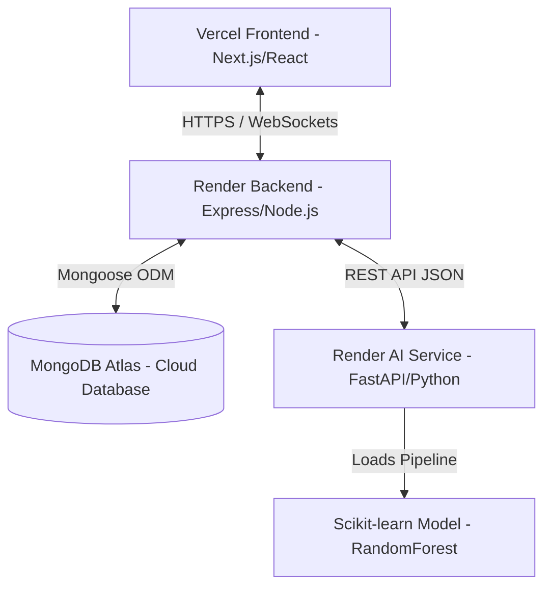
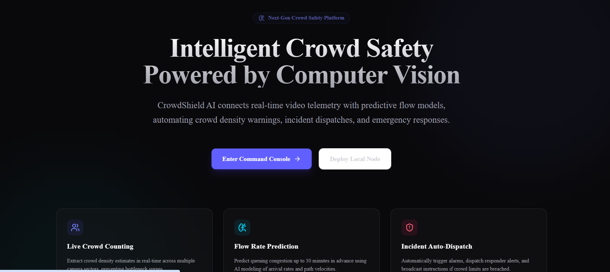
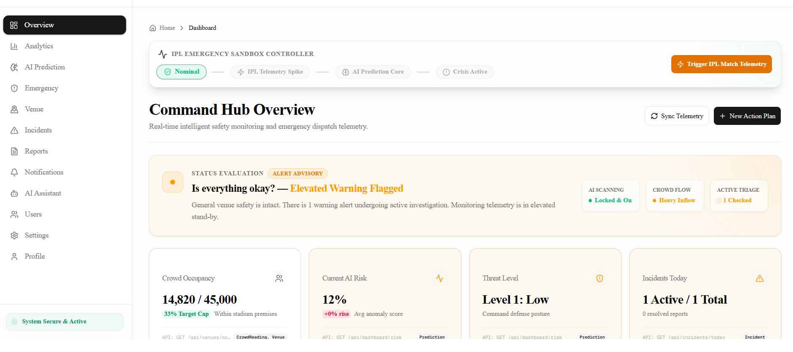
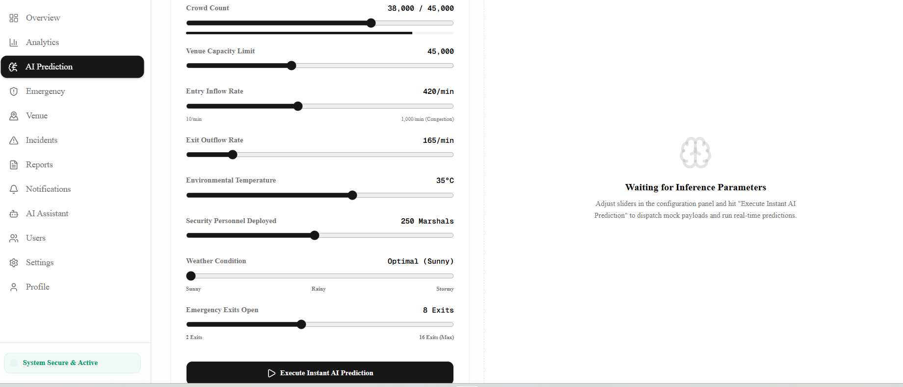
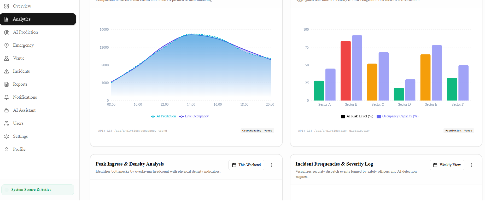
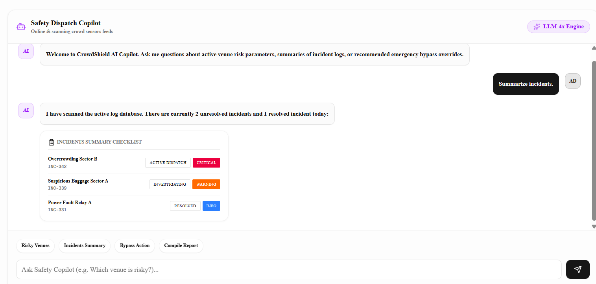
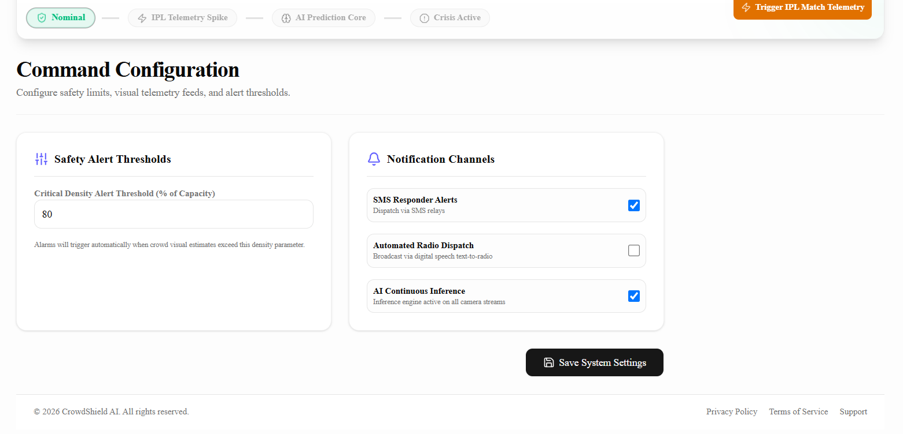
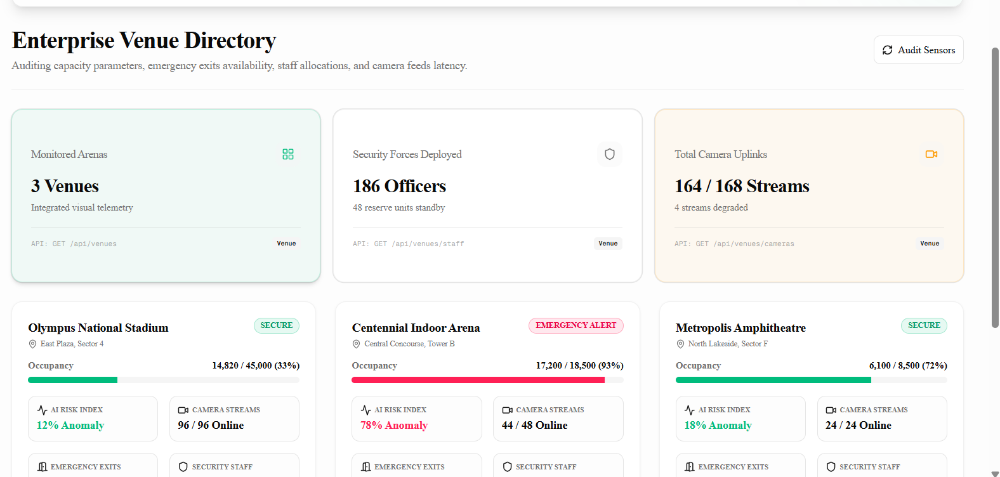

# 🛡️ CrowdShield AI

CrowdShield AI is a state-of-the-art, intelligent real-time crowd safety management and security command center platform. By connecting real-time video telemetry analysis with predictive ML flow models, the platform automates crowd density warnings, visualizes threat vectors, predicts risk levels, and generates actionable, context-aware dispatch instructions to prevent critical bottlenecks and safety incidents in crowded venues.

---

### 🚀 Tech Badges
   
[](https://nextjs.org/)
[](https://www.typescriptlang.org/)
[](https://nodejs.org/)
[](https://expressjs.com/)
[](https://www.mongodb.com/cloud/atlas)
[](https://fastapi.tiangolo.com/)
[](https://www.python.org/)
[](https://render.com/)
[](https://vercel.com/)

---

## 🔗 Live Demo Links

Experience the platform live across all deployment stages:

*   **🌐 Frontend Application (Vercel):** [https://crowd-shield-ai-eight.vercel.app](https://crowd-shield-ai-eight.vercel.app)
*   **⚙️ Backend API Documentation (Render / Swagger):** [https://crowdshield-backend-zvnh.onrender.com/api/docs](https://crowdshield-backend-zvnh.onrender.com/api/docs)
*   **🧠 AI Service API Reference (Render / Redoc/Swagger):** [https://crowdshield-ai-7kok.onrender.com/docs](https://crowdshield-ai-7kok.onrender.com/docs)

---

## 🏗️ System Architecture

CrowdShield AI is built as a highly decoupled microservices architecture designed for low latency, secure data transit, and high availability:



1.  **Vercel Frontend (Next.js/TS)**: Serves as the real-time command dashboard. It displays live telemetry status, receives instant WebSocket alerts, showcases analytical graphs, and hosts the operator's conversational AI assistant.
2.  **Render Backend (Express/TS)**: Coordinates business logic, tracks state history, registers manual & AI-detected incidents, manages Twilio SMS alerting, and connects to the database.
3.  **FastAPI AI Service (Python/FastAPI)**: Serves real-time ML inference. When provided with venue occupancy, entry/exit rates, weather, and logistics parameters, it passes the telemetry through a trained Random Forest Classifier pipeline, yielding risk classifications and emergency-response mitigation protocols.
4.  **MongoDB Atlas**: The scalable, persistent layer tracking historical safety configurations, active incident reports, audit logs, and venue telemetry profiles.

---

## ✨ Key Features

*   **📊 Live Command Hub Overview**: Centralized screen showing crowd counts, current AI risk index, security threat postures, active triage items, and live event telemetry spike simulations (e.g. mock IPL match telemetry spikes).
*   **🔮 Predictive AI Crowd Inference**: Custom machine learning pipeline running a Random Forest Classifier to dynamically predict Low, Medium, High, or Critical crowd safety risk levels with confidence percentages and action recommendations.
*   **💬 Safety Dispatch Copilot**: A conversational LLM-powered assistant integrated into the control room to instantly summarize active incident checklists, filter risky venues, and draft emergency action files.
*   **🗺️ Enterprise Venue Directory**: Comprehensive view of multiple monitored arenas, mapping occupancy limits, active camera streams, emergency exits, and deployed security marshals.
*   **📈 Telemetry & Analytics Dashboard**: Built-in interactive charting engine analyzing Peak Ingress & Density index, hourly occupancy trends, incident timeline frequencies, and risk distributions.
*   **⚙️ Thresholds & Alerts Configurator**: Live customization panel to edit critical density warning percentages, toggle notification channels (SMS alerts, radio dispatch, continuous AI scans), and trigger manual alarms.

---

## 🛠️ Tech Stack Details

| Layer | Technology | Primary Purpose |
| :--- | :--- | :--- |
| **Frontend** | Next.js 16 (React 19), TypeScript, Tailwind CSS, Framer Motion | Dynamic, fluid, and responsive single-page command dashboard |
| **State & Charts** | Zustand, React Query, Recharts, React Leaflet | Local state management, async caching, and interactive telemetry data charts/maps |
| **Backend** | Node.js, Express, TypeScript, Socket.io | Core server API, real-time WebSocket notifications, and system dispatch logic |
| **Database** | MongoDB Atlas, Mongoose ODM | Cloud document storage for incident records, user logs, and venue states |
| **AI & ML Engine** | FastAPI, Python 3, Scikit-learn, Pandas, NumPy | Low-overhead predictive inference API running a trained Random Forest model |
| **Cloud Hosting** | Vercel (Frontend), Render (Backend & AI), MongoDB Atlas | Highly available serverless and containerized deployment workflow |

---

## 🖼️ Project Screenshots

### 🏠 Landing Home Page


### 📊 Command Hub Dashboard


### 🔮 AI Prediction Interface


### 📈 Crowd Analytics Dashboard


### 💬 Safety Dispatch Copilot


### ⚙️ Command Configuration Panel


### 🏟️ Enterprise Venue Directory


---

## 🚀 Installation & Local Development

To run the entire CrowdShield AI stack locally, follow these steps:

### Prerequisites
*   Node.js (v18 or higher)
*   Python (v3.9 or higher)
*   MongoDB Atlas cluster (or a running local MongoDB instance)

### 1. Clone the Repository
```bash
git clone https://github.com/AshishG66/CrowdShield-AI.git
cd CrowdShield-AI
```

### 2. Configure and Run the Backend API
Navigate to the `backend/` directory:
```bash
cd backend
npm install
```
Create a `.env` file in the `backend/` folder and populate it:
```env
PORT=5000
MONGODB_URI=your_mongodb_connection_string
JWT_SECRET=your_jwt_signing_key
AI_SERVICE_URL=http://localhost:8000
# Twilio Integration (Optional)
TWILIO_ACCOUNT_SID=your_twilio_sid
TWILIO_AUTH_TOKEN=your_twilio_token
TWILIO_PHONE_NUMBER=your_twilio_phone
```
Run the backend in development mode:
```bash
npm run dev
```
The server will boot on `http://localhost:5000`. You can inspect the interactive Swagger API docs at `http://localhost:5000/api/docs`.

### 3. Configure and Run the Frontend UI
Navigate to the `frontend/` directory in a new terminal window:
```bash
cd frontend
npm install
```
Run the frontend in development mode:
```bash
npm run dev
```
Open `http://localhost:3000` to view the command dashboard.

### 4. Configure and Run the AI Prediction Service
Navigate to the `ai-service/` directory in a new terminal window:
```bash
cd ai-service
```
Create and activate a virtual environment:
```bash
# On Windows
python -m venv venv
.\venv\Scripts\activate

# On macOS/Linux
python3 -m venv venv
source venv/bin/activate
```
Install python dependencies:
```bash
pip install -r requirements.txt
```
*(Optional)* Train the scikit-learn model using the synthetic telemetry generator script:
```bash
python generate_data.py
python train.py
```
This trains a new Random Forest Classifier and dumps `model.pkl` to the directory.

Start the FastAPI inference engine:
```bash
uvicorn main:app --reload --port 8000
```
The AI predictive endpoint is live at `http://localhost:8000/predict`. Read the Redoc/Swagger specs at `http://localhost:8000/docs`.

---

## 🔮 Future Enhancements

*   **📹 Live RTSP Stream Segmentation**: Integrate real-time object detection (e.g., YOLOv8) directly on client webcam/RTSP feeds to dynamically count attendees rather than relying on slider simulations.
*   **🗺️ Spatial Density Heatmaps**: Render active 3D web-GL hot-spots showing queue clustering over stadium seating layouts.
*   **📞 Automated Emergency Broadcasts**: Connect with Twilio Voice / WhatsApp API to dispatch automated, localized emergency evacuation warnings based on sectors.
*   **⛓️ Offline Mesh Routing**: Deploy low-power Bluetooth mesh integration to allow local marshals to communicate emergency triage statuses when network cell towers are congested.

---

*Developed for next-generation venue operations and crowd safety engineering.*
